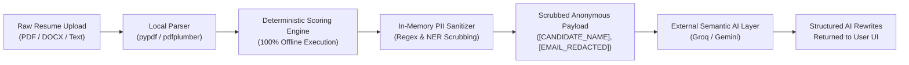

<div align="center">

# Career Catalyst
### Enterprise AI-Powered Career Development, ATS Analytics & Technical Assessment Platform

[](LICENSE)
[](https://www.python.org/)
[](https://www.djangoproject.com/)
[](https://neon.tech/)
[](https://www.tensorflow.org/js)
[](https://getbootstrap.com/)
[](#-privacy-shield--zero-data-leakage-guarantee)

<p align="center">
  <b>A production-grade, privacy-first career acceleration platform delivering deterministic ATS resume parsing, AI-driven skill gap recommendations, proctored browser coding sandboxes, curated engineering roadmaps, and 1-on-1 mentorship.</b>
</p>

</div>

---

## 📌 Executive Summary

**Career Catalyst** is an enterprise-ready career engineering platform designed to bridge the structural divide between modern computer science education and production industry expectations. 

Built on a decoupled, modular Django architecture, the platform combines **100% offline, deterministic evaluation engines** with **privacy-guarded semantic AI layers** and **client-side computer vision proctoring**. It empowers candidates to systematically diagnose resume weaknesses, benchmark skills against industry taxonomies, prove technical proficiency in integrity-enforced coding assessments, and follow tailored 30/60/90-day career pathways.

---

## 🏛️ System Architecture Blueprint

```
                                  ┌──────────────────────────────────────────────┐
                                  │          Career Catalyst Core SaaS           │
                                  │     (Django 5.2 • PostgreSQL / Neon)         │
                                  └──────────────────────┬───────────────────────┘
                                                         │
         ┌────────────────────────┬──────────────────────┼──────────────────────┬────────────────────────┐
         │                        │                      │                      │                        │
         ▼                        ▼                      ▼                      ▼                        ▼
┌──────────────────┐    ┌──────────────────┐   ┌──────────────────┐   ┌──────────────────┐     ┌──────────────────┐
│  Hybrid ATS &    │    │  Career Readiness│   │  Proctored Code  │   │ Curated Learning │     │  1-on-1 Mentor   │
│  Resume Engine   │    │  & Gap Matrix    │   │  Sandbox Engine  │   │ Roadmaps Track   │     │  & Community Hub │
│ (apps/ai_resume) │    │(apps/recommend.) │   │(apps/interviews) │   │ (apps/roadmaps)  │     │ (apps/community) │
└────────┬─────────┘    └──────────────────┘   └────────┬─────────┘   └──────────────────┘     └──────────────────┘
         │                                              │
         ▼                                              ▼
┌──────────────────┐                           ┌──────────────────┐
│ In-Memory PII    │                           │ Client Vision ML │
│ Sanitizer Shield │                           │ (BlazeFace/COCO) │
└────────┬─────────┘                           └──────────────────┘
         │
         ▼ (Zero PII Payload)
┌──────────────────┐
│ Semantic AI Layer│
│  (Groq / Gemini) │
└──────────────────┘
```

---

## 🎯 Core Use Cases & Stakeholders

| Stakeholder | Primary Value Proposition | Key Features Utilized |
| :--- | :--- | :--- |
| **Students & Job Seekers** | Quantify ATS readiness, eliminate resume blindspots, and verify skills before job applications. | Hybrid ATS Analyzer, Google XYZ Bullet Rewriter, Split-Screen PDF Builder, Learning Roadmaps. |
| **Technical Candidates** | Practice real-world coding challenges under proctored, realistic interview conditions. | Multi-Theme Code Sandbox (Python, JS, Java), Anti-Cheating Computer Vision Monitor. |
| **Career Mentors & Coaches** | Guide aspiring talent through structured milestone tracking and direct private consultations. | Mentor Directory, Direct Messaging Rooms, Competency Radar Verification. |
| **Universities & Bootcamps** | Standardize career preparation workflows with measurable placement readiness metrics. | Multi-Factor Readiness Index, Placement Analytics, Role Benchmark Matrix. |

---

## ⚡ Core Technical Capabilities

### 1. 📄 Hybrid ATS Resume Analyzer & Privacy Shield (`apps/ai_resume/` & `apps/resume/`)
The resume evaluator operates on a dual-layer architecture prioritizing candidate privacy, explainability, and deterministic precision:

- **100% Offline Deterministic Scoring Engine**:
  - **Skill Taxonomy Matching**: Compares extracted text against a curated library of **5,000+ technical skills, tools, and domain aliases** categorized by role.
  - **TF-IDF & N-Gram Job Matcher**: Computes weighted cosine similarity and direct keyword coverage against target Job Descriptions with stop-word filtration.
  - **Google XYZ Formula Evaluator**: Parses resume bullet points to detect strong action verbs vs. weak passive phrases and flags unquantified achievements.
  - **Single Executive Score**: Synthesizes skill coverage, keyword density, achievement quantification, and formatting completeness into an intuitive 0–100 ATS readiness score.

- **In-Memory PII Sanitizer (Privacy Shield)**:
  - Automatically scrubs Candidate Names, Emails, Phone Numbers (US & International formats), LinkedIn/GitHub URLs, Portfolio links, Physical Addresses, and University names before external API interaction.
  - Guarantees **Zero Data Leakage**—only sanitized technical experience keywords reach external LLM endpoints.

- **Optional Semantic AI Enhancement Layer**:
  - Integrates with Groq/Gemini multi-model fallback to provide contextual, high-impact bullet point rewrites adhering to the Google XYZ framework (`Accomplished [X] as measured by [Y], by doing [Z]`).
  - Includes a 1-click clipboard copy workflow for instantaneous resume editing.

- **Interactive Split-Screen Resume Builder**:
  - Live DOM-to-PDF synchronization with sub-second preview rendering, customizable layout themes, and structured entry managers (Education, Experience, Projects, Certifications).

---

### 2. 🧠 AI Career Recommendation & Readiness Matrix (`apps/recommendation/`)
- **Multi-Factor Readiness Index**: Mathematically assesses student career readiness using a calibrated formula combining verified skills, academic performance, project complexity, and credentials.
- **6-Axis Competency Radar**: Renders interactive, multi-dimensional competency radar charts using Chart.js to visualize proficiency across Core Languages, Frameworks, System Design, DevOps, and Problem Solving.
- **Dynamic Transition Roadmaps**: Synthesizes 30/60/90-day structured career action plans targeting specific dream roles with deterministic database fallbacks.

---

### 3. 💻 Proctored Coding Sandbox & Skill Evaluation (`apps/interviews/`)
- **In-Browser Multi-Language Execution**: Custom code execution sandbox supporting Python, JavaScript, and Java with automated indentation parsing and multi-theme syntax highlighting (VS Dark, Monokai, Solarized).
- **Client-Side Computer Vision Proctoring**:
  - **Face Landmark & Head Pose Tracking (BlazeFace)**: Flags candidates looking away from the screen for extended intervals or turning away.
  - **Object & Multi-Person Detection (COCO-SSD)**: Detects unauthorized cell phones, secondary persons in the camera frame, and absent candidates in real time.
- **Integrity & Anti-Cheating Defense**:
  - Real-time event telemetry tracking window blurs, full-screen exits, tab switching, and right-click inspection attempts with automated soft and hard submission thresholds.

---

### 4. 🧭 Curated Engineering Roadmaps (`apps/roadmaps/`)
- **15+ Industry Pathways**: Step-by-step 12-week comprehensive roadmaps spanning Software Engineering, Frontend/Backend, Full Stack, Data Science, DevOps, Cybersecurity, and AI/ML Engineering.
- **Persistent Milestone Tracker**: Interactive weekly milestone checklists with real-time completion percentages and persistent database state.

---

### 5. 🤝 1-on-1 Mentorship Network & Community Hub (`apps/community/`)
- **Verified Industry Mentor Directory**: Searchable mentor directory with filters for domain specialization, company affiliation, and mentee ratings.
- **Direct Messaging Rooms**: Private asynchronous communication channels for portfolio reviews, mock interview feedback, and career guidance.
- **Discussion Channels**: Collaborative topic-based forums for interview preparation, resume reviews, and industry insights.

---

### 6. 🛡️ Enterprise Security & Identity Management (`apps/accounts/`)
- **PBKDF2-Hashed OTP Authentication**: Secure 6-digit email verification with cryptographic hashing, brute-force rate-limiting (5-attempt lock), and 60-second resend cooldowns.
- **Dual-Relay Email Service**: Automatically routes outbound mail through HTTPS REST APIs on cloud container environments to bypass PaaS SMTP port blocks, with standard SMTP fallback for local environments.
- **Hardened Web Security**: Native Django CSRF token enforcement, SQL injection defense via Django ORM, and client-side anti-inspect protections.

---

## 🔒 Privacy Shield & Zero-Data-Leakage Guarantee

Career Catalyst implements an air-gapped data sanitization pipeline ensuring that personal candidate information is never exposed to third-party AI models:



---

## 🛠️ Technology Stack

| Domain | Technologies |
| :--- | :--- |
| **Backend Framework** | Python 3.10+, Django 5.2 (Modular SaaS Architecture) |
| **Database & ORM** | PostgreSQL (Production / Neon Serverless), SQLite (Local Dev Fallback), Django ORM |
| **NLP & Scoring Engine** | Pure-Python TF-IDF Vectorizer, Cosine Similarity, N-Gram Extractor, Custom 5,000+ Taxonomy |
| **AI / Machine Learning** | Groq API (LLaMA-3.3, Qwen 2.5, GPT-OSS), Google Gemini 1.5 Flash |
| **Computer Vision & ML** | TensorFlow.js, BlazeFace (Facial Tracking), COCO-SSD (Object & Phone Detection) |
| **Frontend Architecture** | HTML5, CSS3 Custom Properties (Design System), Bootstrap 5.3, Vanilla ES6+ JavaScript |
| **Data Visualization** | Chart.js 4.x (Radar & Performance Visualizations) |
| **Static Assets & Serving** | WhiteNoise 6.x (Gzip / Brotli Compression), Gunicorn WSGI |
| **Security & Privacy** | PBKDF2 Password Hashing, CSRF Protection, In-Memory PII Sanitizer, XSS Defense |

---

## 📁 Modular Application Structure

```text
Career-Catalyst-Django/
├── apps/
│   ├── accounts/          # Authentication, PBKDF2 OTP verification, Custom User identity
│   ├── ai_resume/         # Hybrid ATS analyzer, NLP vectorizer, taxonomy, PII sanitizer
│   ├── community/         # Mentor directory, 1-on-1 direct messaging & forums
│   ├── core/              # Global landing views, dashboard dispatchers, core UI partials
│   ├── interviews/        # Code sandbox, proctoring stream & automated test runners
│   ├── profiles/          # User profile management, skill portfolios & certifications
│   ├── recommendation/    # Readiness scoring index, 6-axis radar logic, LLM pathways
│   ├── resume/            # Dynamic resume builder, split-screen PDF preview engine
│   ├── roadmaps/          # Multi-track learning pathways, weekly checklists & progress
│   └── tracker/           # Application lifecycle tracking & milestone logging
├── config/                # Project URL routing, WSGI/ASGI handlers, global settings
├── static/                # Design systems, utility stylesheets, proctoring scripts
│   ├── css/               # base.css, components.css, chatbot.css, home.css
│   └── js/                # main.js (theme engine & anti-inspect), home.js, chatbot.js
├── templates/             # Semantic Django template hierarchy with reusable partials
├── requirements.txt       # Frozen package dependencies
└── manage.py              # Django administrative CLI
```

---

## 📄 License

This project is licensed under the **MIT License** — see the [LICENSE](LICENSE) file for details.

---

<div align="center">
  <sub>Career Catalyst — Designed and Engineered for Modern Technical Talent.</sub>
</div>