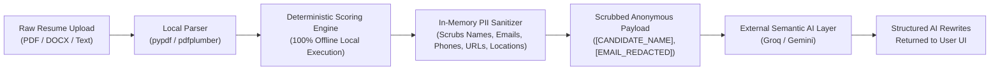

<div align="center">

# Career Catalyst
### The All-in-One Career Engineering & Guidance Platform for Fresh Graduates & Aspiring Engineers

[](LICENSE)
[](https://www.python.org/)
[](https://www.djangoproject.com/)
[](https://neon.tech/)
[](https://www.tensorflow.org/js)
[](https://getbootstrap.com/)
[](#-privacy-shield--zero-data-leakage-guarantee)

<p align="center">
  <b>Bridging the gap between college education and industry hiring. A unified, privacy-first platform featuring structured career roadmaps with curated resources, AI readiness benchmarks, 1-on-1 mentorship, proctored coding assessments, and ATS resume analytics.</b>
</p>

</div>

---

## 💡 Why We Built Career Catalyst (The Problem & Our Story)

Every year, millions of bright, hardworking engineering students and fresh graduates—especially those from **Tier-2 and Tier-3 colleges**—step out with ambition and a clear dream in mind: *"I want to become a Software Engineer"*, *"I want to break into Data Science"*, or *"I want to get into Cloud & DevOps"*. 

Yet, despite their drive, they hit severe structural roadblocks:

1. **The Roadmap Vacuum ("I Don't Know Where to Start")**: Students know their target role, but have no clear, ordered blueprint of *what* concepts to master, *in what sequence*, and *why*. They get stuck jumping aimlessly between random video tutorials without a real learning plan.
2. **The Resource Desert & Tutorial Hell**: Finding high-signal, practical, industry-relevant study materials is brutally difficult. Quality learning content is scattered across hundreds of paid paywalls, outdated blogs, or superficial video courses. Students spend more time hunting for resources than actually building.
3. **The "Where Do I Stand?" Blindspot**: College grades (GPA) rarely reflect real-world industry readiness. Students have no objective, transparent way to evaluate whether their current skills, projects, and fundamentals are truly good enough to land interviews in their target domain.
4. **The Fragmented Tool Nightmare**: To prepare for placements, students are forced to juggle 5–6 disconnected websites: one for roadmaps, another for coding practice, a separate one for ATS resume checkers, an external tool to track job applications, and paid platforms to find mentors—most of which charge steep subscription fees or leak personal candidate data to third-party LLMs.

### 🎯 Our Mission
**Career Catalyst was created to level the playing field for every aspiring engineer.** 

We built a single, unified, open platform where any student—regardless of their college tier or background—can pick their dream domain, follow structured 12-week roadmaps with handpicked free resources, benchmark their exact readiness using AI guidance, practice in real proctored coding sandboxes, build ATS-proof resumes, connect with industry mentors, and track their applications from start to finish.

---

## 🌟 CORE HERO CAPABILITIES

### 1. 🗺️ Curated 15+ Industry Roadmaps with Handpicked Resources (`apps/roadmaps/`)
*No more searching the entire internet for what to learn.* Career Catalyst provides step-by-step, 12-week comprehensive learning roadmaps tailored to industry requirements:

- **15+ Specialized Engineering Tracks**: Including Software Engineering, Frontend/Backend, Full Stack, Data Science, DevOps & Cloud, AI/ML Engineering, Cybersecurity, QA Automation, and Mobile Development.
- **Handpicked High-Signal Learning Resources**: Every single milestone is packed with curated documentation, free high-quality tutorials, open-source repositories, and practical project prompts—eliminating the pain of resource hunting.
- **Persistent Milestone Progress Tracking**: Interactive weekly checklists allow students to check off completed milestones and track their progress percentage in real time.

---

### 2. 🧠 AI Career Guidance & Readiness Matrix — "Where Do You Stand?" (`apps/recommendation/`)
*Know your exact market viability before you apply.* Our intelligent guidance engine helps students understand their current standing and bridges their exact technical gaps:

- **Placement Readiness Index**: Quantifies career readiness using a multi-factor formula combining technical skill coverage, academic performance, project complexity depth, and verified certifications.
- **6-Axis Interactive Competency Radar**: Renders dynamic Chart.js radar charts visualizing proficiency across Core Languages, Frameworks, System Design, DevOps, Databases, and Problem Solving.
- **Personalized 30/60/90-Day Transition Roadmaps**: AI analyzes the student's target role, detects missing competencies, and generates customized step-by-step transition plans with deterministic database fallbacks.

---

### 3. 🛡️ Privacy-Guarded Hybrid ATS Resume Engine & Builder (`apps/ai_resume/` & `apps/resume/`)
*Ensure resumes pass automated ATS filters without leaking personal data.* 

- **100% Offline Local Deterministic Scoring**:
  - **5,000+ Skills Taxonomy**: Checks resume text against a curated library of technical competencies, frameworks, and aliases.
  - **TF-IDF & N-Gram Job Matcher**: Mathematically calculates keyword coverage and cosine similarity against target Job Descriptions.
  - **Google XYZ Impact Formula Evaluator**: Evaluates bullet points against the Google recruitment standard (`Accomplished [X] as measured by [Y], by doing [Z]`), classifying strong action verbs and flagging unquantified metrics.
  - **Unified Executive ATS Score (0–100)**: Clean, single-glance score hero synthesizing skill coverage, keyword density, and formatting.
- **In-Memory PII Sanitizer (Zero-Data-Leakage Guarantee)**:
  - In-memory regex & NER filters automatically scrub Candidate Names, Emails, Phone Numbers, LinkedIn/GitHub URLs, Portfolio links, Physical Addresses, and University names before any external AI payload is generated.
- **1-Click AI Bullet Rewriter**: Generates executive-level bullet point rewrites following the XYZ formula with instant clipboard copying.
- **Interactive Split-Screen Resume Builder**: Live DOM-to-PDF synchronization with real-time preview rendering.

---

### 4. 💻 Live AI-Proctored Coding Sandbox & Skill Assessment (`apps/interviews/`)
*Practice real-world coding challenges under realistic interview conditions.*

- **Multi-Language In-Browser Code Execution**: Interactive sandbox supporting **Python, JavaScript, and Java** with auto-indentation and multiple syntax themes (VS Dark, Monokai, Solarized).
- **Client-Side Computer Vision Proctoring**:
  - **BlazeFace Facial Landmark Tracking**: Detects when candidates look away from the screen or exit the camera viewport.
  - **COCO-SSD Anomaly & Device Detection**: Detects unauthorized cell phones and secondary persons in the frame.
- **Anti-Cheating Telemetry**: Tracks window blurs, full-screen exits, tab switching, and DevTools inspection attempts with configurable warning thresholds.

---

### 5. 🤝 1-on-1 Mentorship Network & Community Hub (`apps/community/`)
*Direct guidance from engineers who have been there.*

- **Verified Mentor Directory**: Connect with industry mentors filtered by domain expertise, company affiliation, and mentee ratings.
- **Direct Messaging Rooms**: Private asynchronous communication for portfolio reviews, mock interview feedback, and career guidance.
- **Collaborative Discussion Forums**: Topic-specific threads for interview preparation and peer support.

---

### 6. 📊 Job Application & Opportunity Tracker (`apps/tracker/`)
*Organize your entire job search pipeline in one place.*

- **Visual Application Pipeline**: Track applications across stages: *Applied, Shortlisted, Technical Assessment, Interview Scheduled, Offer Extended, or Rejected*.
- **Deadline & Follow-Up Reminders**: Keep notes, interview links, recruiter contacts, and scheduled interview dates organized.

---

### 7. 🔐 Enterprise Security & Identity Management (`apps/accounts/`)
- **PBKDF2-Hashed OTP Verification**: Secure 6-digit email verification with cryptographic hashing, brute-force rate-limiting (5 attempts lock), and 60-second resend cooldowns.
- **Dual-Relay Email Engine**: Automatically routes outbound mail through HTTPS REST APIs (Brevo) on cloud environments to bypass PaaS SMTP port blocks, with standard SMTP fallback for local development.

---

## 🔒 Privacy Shield & Zero-Data-Leakage Flow



---

## 🏛️ System Architecture Blueprint

```
                                  ┌──────────────────────────────────────────────┐
                                  │          Career Catalyst Core SaaS           │
                                  │     (Django 5.2 • PostgreSQL / Neon)         │
                                  └──────────────────────┬───────────────────────┘
                                                         │
         ┌────────────────────────┬──────────────────────┼──────────────────────┬────────────────────────┐
         │                        │                      │                      │                        │
         ▼                        ▼                      ▼                      ▼                        ▼
┌──────────────────┐    ┌──────────────────┐   ┌──────────────────┐   ┌──────────────────┐     ┌──────────────────┐
│ ⭐ ROADMAPS &    │    │ ⭐ AI GUIDANCE & │   │ ⭐ HYBRID ATS &  │   │ ⭐ PROCTORED     │     │ ⭐ MENTOR &      │
│  CURATED TRACKS  │    │  READINESS MATRIX│   │  RESUME BUILDER  │   │  CODE SANDBOX    │     │  JOB TRACKER     │
│ (apps/roadmaps)  │    │(apps/recommend.) │   │ (apps/ai_resume) │   │(apps/interviews) │     │ (apps/community) │
└──────────────────┘    └──────────────────┘   └────────┬─────────┘   └────────┬─────────┘     └──────────────────┘
                                                        │                      │
                                                        ▼                      ▼
                                               ┌──────────────────┐   ┌──────────────────┐
                                               │ In-Memory PII    │   │ Client Vision ML │
                                               │ Sanitizer Shield │   │ (BlazeFace/COCO) │
                                               └────────┬─────────┘   └──────────────────┘
                                                        │
                                                        ▼ (Zero PII Payload)
                                               ┌──────────────────┐
                                               │ Semantic AI Layer│
                                               │  (Groq / Gemini) │
                                               └──────────────────┘
```

---

## 🎯 Stakeholder Value Matrix

| Stakeholder | Primary Value Proposition | Hero Features Utilized |
| :--- | :--- | :--- |
| **Tier-2 & Tier-3 Students** | Get clear, structured direction with curated resources, benchmark readiness, and eliminate resume blindspots. | Curated Roadmaps, AI Guidance & Readiness Radar, Hybrid ATS Resume Engine, Job Tracker. |
| **Fresh Graduates & Job Seekers** | Practice coding in realistic proctored environments and format resumes to industry standards. | Code Execution Sandbox, Google XYZ Bullet Rewriter, Split-Screen PDF Builder. |
| **Industry Mentors & Coaches** | Help aspiring engineers, review portfolios, and guide students on high-impact skills. | Mentor Directory, Direct Messaging Rooms, Competency Radar Verification. |
| **Placement Cells & Bootcamps** | Standardize career preparation workflows with measurable placement readiness metrics. | Multi-Factor Readiness Index, Placement Analytics, Role Benchmark Matrix. |

---

## 🛠️ Technology Stack Matrix

| Domain | Technologies |
| :--- | :--- |
| **Backend Framework** | Python 3.10+, Django 5.2 (Modular SaaS Architecture) |
| **Database & ORM** | PostgreSQL (Production / Neon Serverless), SQLite (Local Dev Fallback), Django ORM |
| **NLP & Scoring Engine** | Pure-Python TF-IDF Vectorizer, Cosine Similarity, N-Gram Extractor, Custom 5,000+ Taxonomy |
| **AI / Machine Learning** | Groq API (LLaMA-3.3, Qwen 2.5, GPT-OSS), Google Gemini 1.5 Flash |
| **Computer Vision & ML** | TensorFlow.js, BlazeFace (Facial Tracking), COCO-SSD (Object & Phone Detection) |
| **Frontend Architecture** | HTML5, CSS3 Custom Properties (Design System), Bootstrap 5.3, Vanilla ES6+ JavaScript |
| **Data Visualization** | Chart.js 4.x (Radar & Performance Visualizations) |
| **Static Assets & Serving** | WhiteNoise 6.x (Gzip / Brotli Compression), Gunicorn WSGI |
| **Security & Privacy** | PBKDF2 Password Hashing, CSRF Protection, In-Memory PII Sanitizer, XSS Defense |

---

## 📁 Modular Application Structure

```text
Career-Catalyst-Django/
├── apps/
│   ├── roadmaps/          # ⭐ HERO: 15+ curated industry pathways, weekly checklists & resources
│   ├── recommendation/    # ⭐ HERO: AI career guidance, readiness scoring index & 6-axis radar
│   ├── ai_resume/         # ⭐ HERO: Hybrid ATS analyzer, NLP vectorizer, taxonomy, PII sanitizer
│   ├── interviews/        # ⭐ HERO: Code sandbox, computer vision proctoring & test runners
│   ├── tracker/           # ⭐ HERO: Job application tracker, deadline reminders & pipeline
│   ├── community/         # ⭐ HERO: Mentor directory, 1-on-1 direct messaging & forums
│   ├── resume/            # Dynamic resume builder, split-screen PDF preview engine
│   ├── accounts/          # Authentication, PBKDF2 OTP verification, Custom User identity
│   ├── core/              # Global landing views, dashboard dispatchers, core UI partials
│   └── profiles/          # User profile management, skill portfolios & certifications
├── config/                # Project URL routing, WSGI/ASGI handlers, global settings
├── static/                # Design systems, utility stylesheets, proctoring scripts
│   ├── css/               # base.css, components.css, chatbot.css, home.css
│   └── js/                # main.js (theme engine & anti-inspect), home.js, chatbot.js
├── templates/             # Semantic Django template hierarchy with reusable partials
├── requirements.txt       # Frozen package dependencies
└── manage.py              # Django administrative CLI
```

---

## 📄 License

This project is licensed under the **MIT License** — see the [LICENSE](LICENSE) file for details.

---

<div align="center">
  <sub>Career Catalyst — Designed and Engineered to Empower Modern Technical Talent.</sub>
</div>